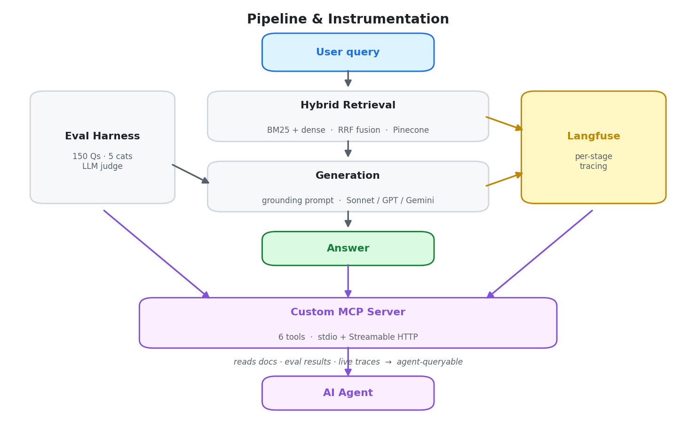
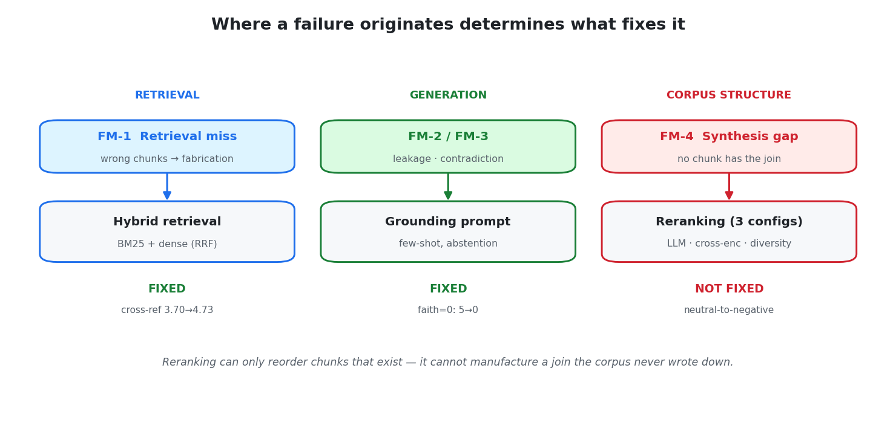
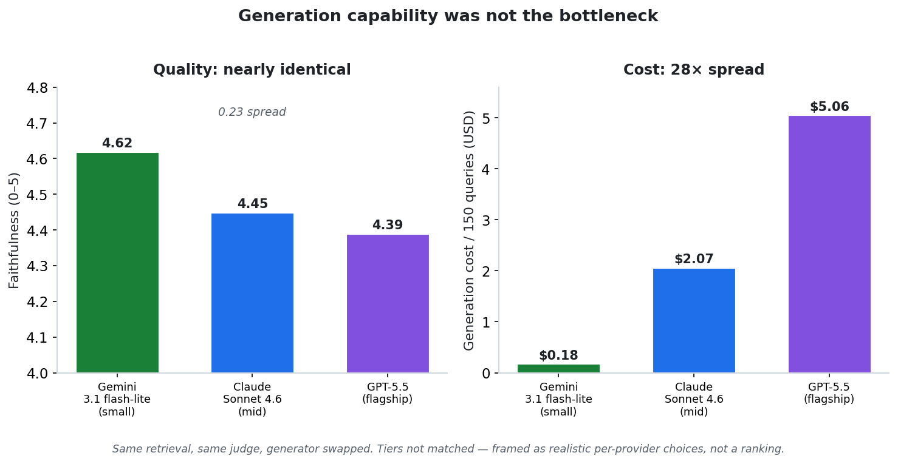
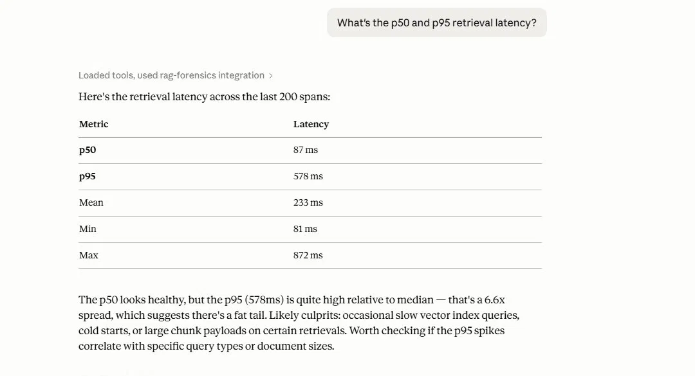

# Production RAG Stack Forensics

A forensic record of building a production RAG system on the industry-standard stack — LangGraph, Pinecone, Langfuse, frontier LLM APIs — over the FastAPI documentation corpus, and measuring, honestly, where it breaks. Documents four failure modes, an evaluation-harness bug that inverted a cross-provider conclusion, and the finding that generation-model capability was not the bottleneck once retrieval and grounding were strong.

**The system works. The autopsy is the deliverable.**

---

## 📄 Choose your depth

| Format | Length | Time | What it is |
|---|---|---|---|
| **[Autopsy PDF](RAG_Forensics_Autopsy.pdf)** | 5 pages | ~6 min | The condensed record: how it's built, the failure modes, the judge bug, cost/latency/quality. Start here. |
| **[Engineering docs](./docs)** | 3 docs | varies | The living record — `journal.md` (chronological), `failure_modes.md` (5-section writeups), `architecture.md` (locked decisions). |
| **[MCP demo](./docs/mcp_demo.md)** | — | ~3 min | The instrumentation queried live from an AI agent. See the tooling actually work. |

---

## The headline

```
584 chunks indexed from the FastAPI docs.
150 hand-curated eval questions across 5 categories.
4 RAG failure modes documented + 1 eval-harness failure mode.
1 judge bug that scored against empty chunks for most of the project —
  and would have shipped a confidently wrong cross-provider conclusion.
0.23 faithfulness spread across a 28× generation-cost range.
```

The most important finding is not about the RAG system — it's about the measurement. For most of the build, the LLM judge scored faithfulness against **empty chunk content**, rewarding citation *style* as a proxy for grounding. It stayed invisible because every answer shared one model's style; introducing a second model exposed it. The corrected scores **reversed** the cross-provider result. Trusting the healthy-looking aggregate would have meant publishing a false claim.

---

## Architecture

A three-stage forward pipeline, instrumented end to end, with the instrumentation itself exposed as agent-queryable tools.



---

## The four failure modes

The diagnostic spine of the project: **where a failure originates determines what fixes it.** Retrieval failures need retrieval fixes; generation failures need generation fixes; and some failures are corpus-structural and have no retrieval fix at all.



- **FM-1 — Retrieval miss → fabrication** *(retrieval)*. Dense retrieval returns topically-adjacent but wrong chunks; the model fabricates a confident, grounded-looking answer. Fixed with hybrid retrieval (BM25 + dense, RRF-fused).
- **FM-2 — Parametric leakage** *(generation)*. Right chunks, but the model supplements with training knowledge not in the context. Fixed with a few-shot grounding prompt.
- **FM-3 — Factual contradiction** *(generation)*. The model contradicts what a retrieved chunk explicitly states. Same fix.
- **FM-4 — Synthesis gap** *(corpus)*. No single chunk contains the integration the question needs. **Unfixable by retrieval** — three reranking configurations all measured neutral-to-negative. Reranking can only reorder chunks that exist; it cannot manufacture a join the corpus never wrote down.

Full 5-section writeups (symptom / measurement / mechanism / mitigation / generalization) are in [`docs/failure_modes.md`](./docs/failure_modes.md).

---

## The headline finding: capability wasn't the bottleneck

Same optimized stack, generation model swapped, retrieval and judge held constant (after the judge bug was fixed). Faithfulness spans 0.23 points — noise-level — across a 28× cost range.



When retrieval and grounding are strong, a small, cheap model rides that quality to the same faithfulness as flagships costing an order of magnitude more. The implication: teams routinely over-provision generation models for RAG tasks that good retrieval has already largely solved. *(Bounded claim — a harder corpus might separate the tiers; this one did not. The tiers are not matched, so this is not a provider ranking.)*

---

## See it work — the MCP server

The project's instrumentation is exposed as **six agent-queryable tools** over the Model Context Protocol, spanning three data sources — the engineering docs, the eval results, and live Langfuse traces. Connected to Claude Desktop, an agent can interrogate the forensic record of the system through the same kind of interface a production system would expose.

<!--
SCREENSHOT SLOT 1 — the tool call + a clean result.
Capture ONE screen: the prompt, the "Used rag-forensics integration"
indicator, and a compact result (the latency numbers work well).
Save as figures/mcp_latency.png and embed:


-->

<!--
SCREENSHOT SLOT 2 (optional) — a second tool hitting a different source,
e.g. failure_modes (docs) or eval_results (eval data). One clean screen.
Save as figures/mcp_failure_mode.png and embed.
-->

Full prompt/answer exchanges across all three data backends are in [`docs/mcp_demo.md`](./docs/mcp_demo.md).

**Setup:** the server supports both stdio (local Claude Desktop) and Streamable HTTP (remote) transport. Local Desktop config:

```json
{
  "mcpServers": {
    "rag-forensics": {
      "command": "/absolute/path/to/.venv/Scripts/python.exe",
      "args": ["-m", "production_rag_forensics.mcp_server.server"],
      "env": {
        "MCP_TRANSPORT": "stdio",
        "PYTHONPATH": "/absolute/path/to/repo/src"
      },
      "cwd": "/absolute/path/to/repo"
    }
  }
}
```

---

## Stack

| Layer | Choice |
|---|---|
| Orchestration | LangGraph |
| Vector DB | Pinecone (managed) |
| Observability | Langfuse |
| Embeddings | OpenAI `text-embedding-3-small` |
| Generation | Claude Sonnet 4.6 (primary); GPT-5.5 + Gemini 3.1 flash-lite (cross-provider) |
| Judge | Gemini 2.5 Flash (independent of the generators) |
| Service layer | FastAPI |
| Agent interface | Custom MCP server (stdio + Streamable HTTP) |
| Corpus | FastAPI documentation (584 chunks) |

---

## What this is not

- **Not a tutorial.** It assumes RAG basics.
- **Not a benchmark.** No provider "wins." Tradeoffs are documented with measurements; the cross-provider tiers are deliberately not matched.
- **Not a framework promotion.** Where LangGraph helped, the docs say so; where it was overhead at this pipeline's complexity, the docs say that too.

---

## Repository layout

```
production-rag-forensics/
├── RAG_Forensics_Autopsy.pdf          ← the 5-page condensed record
├── figures/                            ← programmatic figures (reproducible)
│   └── make_figures.py
├── docs/
│   ├── journal.md                      ← chronological engineering journal
│   ├── failure_modes.md                ← 4 RAG modes + eval-harness bug, 5-section each
│   ├── architecture.md                 ← locked design decisions
│   └── mcp_demo.md                     ← live MCP server exchanges
├── src/production_rag_forensics/
│   ├── retrieval/                      ← chunking, embedding, hybrid search
│   ├── orchestration/                  ← LangGraph workflow, generation
│   ├── observability/                  ← Langfuse integration
│   ├── eval/                           ← harness + judge
│   ├── service/                        ← FastAPI app
│   └── mcp_server/                     ← custom MCP server (6 tools)
├── scripts/
│   └── ingest_corpus.py                ← corpus ingestion (pinned release)
└── data/
    └── eval_set.jsonl                  ← 150 hand-curated questions
```

---

## Related work

- **[polymarket-autopsy](https://github.com/clee12111/polymarket-autopsy)** — same forensic methodology applied to a custom trading system.
- **[aether](https://github.com/clee12111/aether)** — retrieval primitives built bottom-up; this project is the production-tools counterpart.

## Author

Cody Lee · [codylee.tech](https://codylee.tech) · [github.com/clee12111](https://github.com/clee12111)